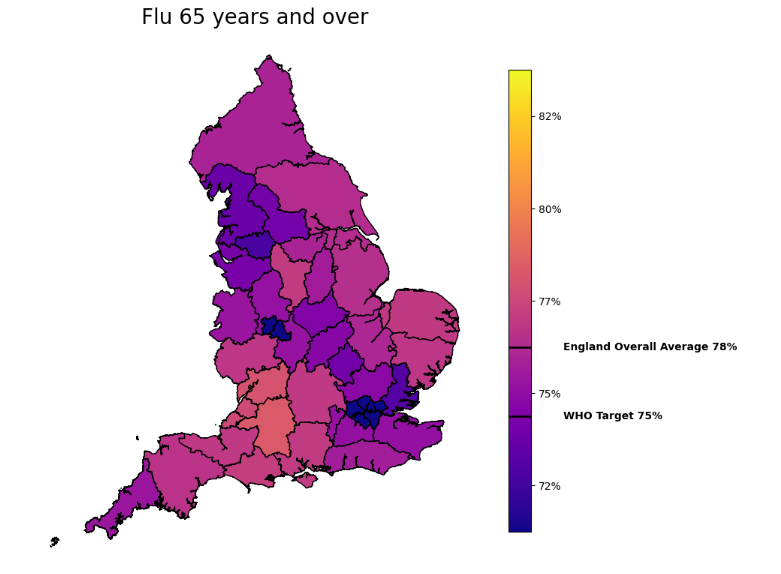
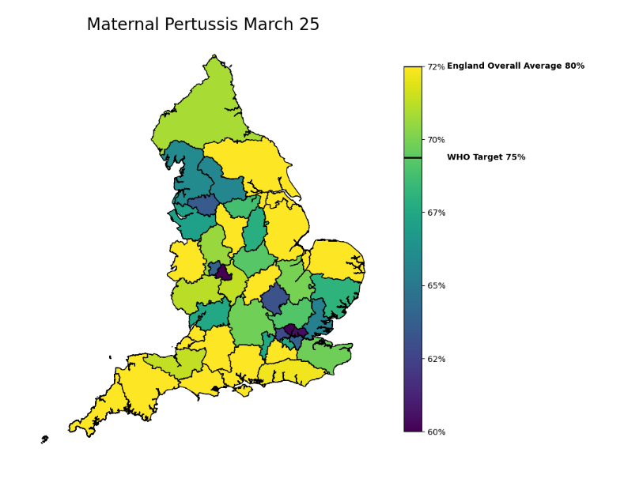

# Choropleth Vaccination Maps

A map engine I created using public vaccination data which is aggregated at ICB level. These cuts are found on gov.uk webpages for each vaccs programme.   

The purpose of the engine was to allow easy configuration and changing of paraneters which meant stakeholder changes could be quickly deployed. It allowed broad changes e.g. colour scheme or text changes to be allocated to a column to eb editted in a a csv rather than changing each individual mapping coding for each map.  

Really enjoyed this piece of work which combined automation with visuals. Taking bland tabular data and making it from a shaded map which anyone can intepret, big important stakeholders or jsut members of the public.   
Through 3 iterations we landed on some final products that blended NHS colour schemes with the performance scale. However for this repo I've included more exotic colour schemes.  

## The components needed to achieve this are:  

**csv** - This is report_standards meta_data_2 file, this allows control of the parameters such as colour scheme and text annotations on the cbar  
**geopandas and geojson** - not included in this repo but can be found on ONS - for plotting the boundaries  
**data**  -  One I manually put  together through various public gov websties for each programmes. The ICB code needed for the join to geojson  
**python notebook** - a python notebook for applying the transformations and reading in the control csv, data and geojson.  

